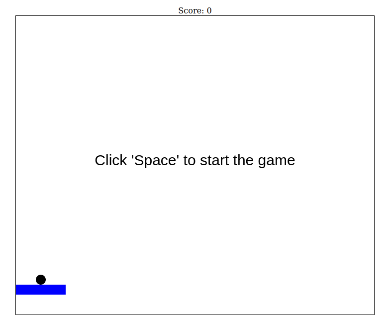

# Breakout


Breakout adalah video game arcade yang dikembangkan dan diterbitkan oleh Atari, Inc. dan dirilis pada 13 Mei 1976. Ini dirancang oleh Steve Wozniak, berdasarkan konseptualisasi dari Nolan Bushnell dan Steve Bristow yang dipengaruhi oleh game arcade Atari tahun 1972, Pong. [Wikipedia Inggris](https://en.wikipedia.org/wiki/Breakout_(video_game))

## Informasi
```
Nama Proyek: Breakout
Versi: 1.0
Pengembang: Billal Fauzan <billal.xcode@gmail.com>
Inspirasi: Breakout Atari, Inc.
```